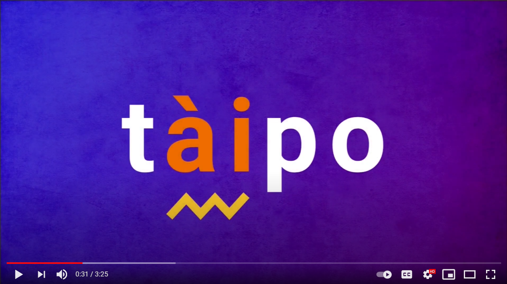

# Tàipo

A multiplayer **typing game** that will take your mistakes to the next level.

The **rules** are simple: get a sentence, type it as fast as you can! But look out for the typos, some letters won't be the ones you expect...

**Built with** [React](https://reactjs.org/), [Typescript](https://www.typescriptlang.org/) and [Sass](https://sass-lang.com/). Powered by [socket.io](https://socket.io/) living on an [Express](https://expressjs.com/) server.

## Demo video

This **solo project** was built in **1 week**, from idea to delivery.

The goal was to experience a complete **development workflow**, making use of **modern technologies** and **best practices**.

### Gameplay 💡

**Fast and realtime**, will require speed and reflexes. Players can see how well is their opponent doing.

**Multiplayer** functionality built with [socket.io](https://socket.io/).
All the game logic is handled on the [express](https://expressjs.com/) **server**, making cheating impossible.

### Social login

Users can **sign in** and register without the need to fill in any forms

**Authentication** is handled with [Firebase](https://firebase.google.com/). [React router](https://reactrouter.com/) then prevents users that are not logged in from accessing certain screens.

### Game modes 🕹

Try it out as a **guest**, just practice your skills without worrying about competition.

Feeling lucky? Sign In and join a **random opponent** for a 1 vs. 1 match. You will see in real time the progress of the other player.

Want to challenge someone specific? Get the code and share it **with a friend** so you can play together.

### Todo 📃

- [ ] **Leaderboard** functionality
- [ ] Implement **testing**, both back-end and front-end
- [ ] **Deployment**

## Tech stack

- [Typescript](https://www.typescriptlang.org/) allowed to **share code** between client and server.
- [React](https://reactjs.org/) was overall the perfect fit to build all the **components** needed
- [Rxjs](https://rxjs.dev/) simplified a very complex **state management** combining observables with a dedicated custom hook.
- [Socket.io](https://socket.io/) was responsible for the **real-time** aspect of the game.
- [Sass](https://sass-lang.com/) made the code **modular and maintainable** in the long run.
- [Howler.js](https://howlerjs.com/) played **sounds** to improve the user experience.
- [GSAP](https://greensock.com/gsap/) provided a robust API for creating **delightful animations**.
- [MongoDB](https://www.mongodb.com/), together with [mongoose](https://mongoosejs.com/), was chosen to **persist the data**.
- [Express](https://expressjs.com/) was picked for it's **reliability and speed**.
